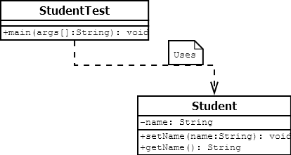

# Object oriented programming

The main goal of OOP is to bind data and code(methods) togather.

> ## OOP provide few concepts
> 
> ### 1.  Encapsulation

* Encapsulation in Java is a process of wrapping code and data together into a single unit.
* create a fully encapsulated class in Java by making private all the data members of the class. 
*  use setter and getter methods to set and get the data in it.
* The Java Bean class is the example of a fully encapsulated class.
* Class Diagram of Student



Student.java
```java
package org.cityU.Encapsulation;

public class Student {
	
	private String name;

	public String getName() {
		return name;
	}

	public void setName(String name) {
		this.name = name;
	}
}

``` 
StudentTest.java

```java
package org.cityU.Encapsulation;

public class StudentTest {

	public static void main(String[] args) {

		Student s = new Student();
		s.setName("Richard");
		
		System.out.println(s.getName());
	}
}

```
> ### 2.   Abstraction
* Abstraction is a process of hiding the implementation details and showing only functionality to the user.
* There are two ways to achieve abstraction in java
	- Abstract class (0 to 100%)
	- Interface (100%)
> ### 3.   Polymorphism
> ### 4.   Inheritance

> Apart from these, there are some other concepts which are used in Object-Oriented design:

* Coupling
* Cohesion
* Association
* Aggregation
* Composition
